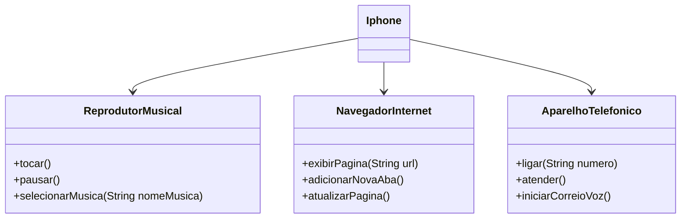

# POO - Iphone

Aplicando praticas de POO com um projeto baseado na usabilidade do Iphone

```mermaid
classDiagram
    Iphone --> ReprodutorMusical
    Iphone --> NavegadorInternet
    Iphone --> AparelhoTelefonico


    class ReprodutorMusical{
      +tocar()
      +pausar()
      +selecionarMusica(String nomeMusica)
    }
    class NavegadorInternet{
      +exibirPagina(String url)
      +adicionarNovaAba()
      +atualizarPagina()
    }
    class AparelhoTelefonico{
      +ligar(String numero)
      +atender()
      +iniciarCorreioVoz()
    }
```
